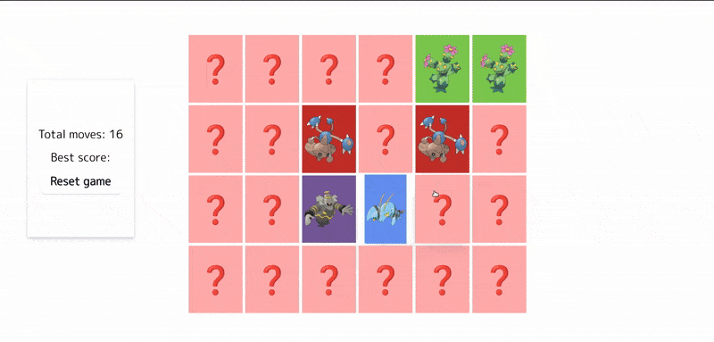

# Pokémon Memory Game

A card-matching memory game built in React. Flip the cards, find every pair, and try to get the lowest score possible!

🔗 [Live Demo on Netlify](https://katekat25-pokecards.netlify.app/)

---

## ⚙️ Technologies Used
- React
- JavaScript (ES6+)
- CSS Modules
- Vite

---

## ✨ Features
- Card flipping animation
- Matching logic with memory tracking
- Pokémon images loaded dynamically from the [PokéAPI](https://pokeapi.co/)
- Confetti celebration for winning
- Responsive design for mobile & desktop
- Restart game logic

---

## 📚 What I Learned
- Improved React state management and component design
- Practiced conditional rendering and event handling
- Learned how to use `useEffect` for game logic
- Gained experience with deploying React apps using Netlify

---

## 🚧 Future Improvements
- Create high score tracking with localStorage
- Animate card shuffle and flip transitions
